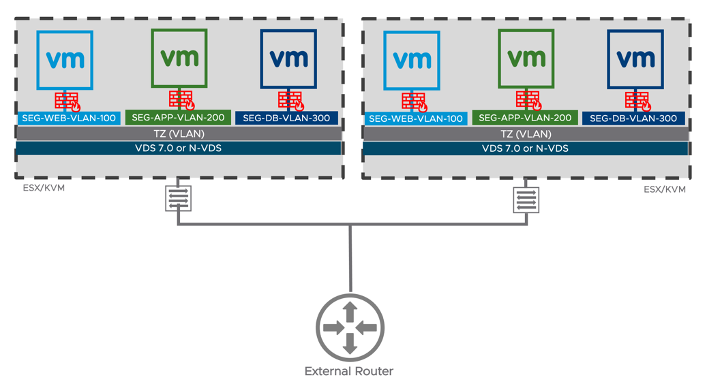
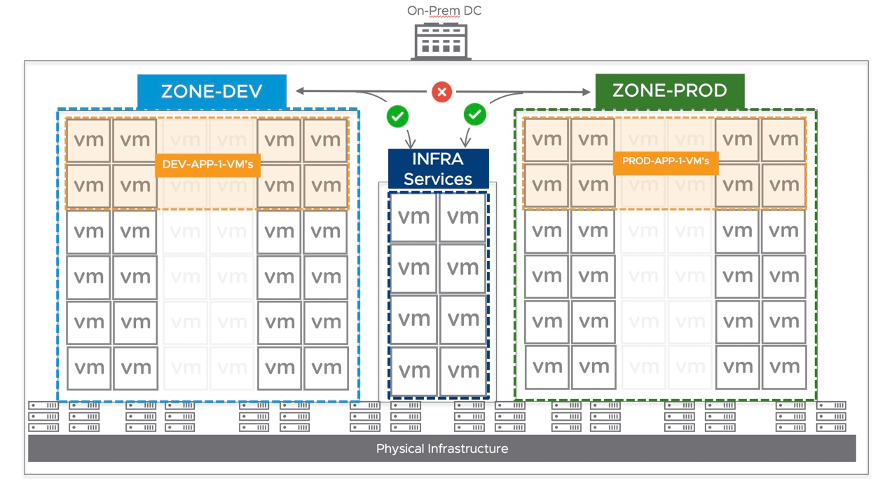

**Table Of Contents**

<!--ts-->
   * [5 NSX-T Security](#5-nsx-t-security)
      * [5.1 NSX-T Security Use Cases](#51-nsx-t-security-use-cases)
      * [5.2 NSX-T DFW Architecture and Components](#52-nsx-t-dfw-architecture-and-components)
         * [5.2.1 Management Plane](#521-management-plane)
         * [5.2.2 Control Plane](#522-control-plane)
         * [5.2.3 Data Plane](#523-data-plane)
      * [5.3 NSX-T Data Plane Implementation - ESXi vs. KVM Hosts](#53-nsx-t-data-plane-implementation---esxi-vs-kvm-hosts)
         * [5.3.1 ESXi Hosts- Data Plane Components](#531-esxi-hosts--data-plane-components)
         * [5.3.2 KVM Hosts- Data Plane Components](#532-kvm-hosts--data-plane-components)
         * [5.3.3 NSX-T DFW Policy Lookup and Packet Flow](#533-nsx-t-dfw-policy-lookup-and-packet-flow)
      * [5.4 NSX-T Security Policy - Plan, Design and Implement](#54-nsx-t-security-policy---plan-design-and-implement)
         * [5.4.1 Security Policy Methodology](#541-security-policy-methodology)
         * [5.4.2 Security Rule Model](#542-security-rule-model)
         * [5.4.3 Security Policy - Consumption Model](#543-security-policy---consumption-model)
            * [Examples of Policy Rules for 3-Tier Application](#examples-of-policy-rules-for-3-tier-application)
      * [5.5 Intrusion Detection](#55-intrusion-detection)
      * [5.6 Service Insertion](#56-service-insertion)
      * [5.7 Additional Security Features](#57-additional-security-features)
      * [5.8 NSX-T Security Enforcement -- Agnostic to Network Isolation](#58-nsx-t-security-enforcement----agnostic-to-network-isolation)
         * [5.8.1 NSX-T Distributed Firewall for VLAN Backed workloads](#581-nsx-t-distributed-firewall-for-vlan-backed-workloads)
         * [5.8.2 NSX-T Distributed Firewall for Mix of VLAN and Overlay backed workloads](#582-nsx-t-distributed-firewall-for-mix-of-vlan-and-overlay-backed-workloads)
         * [5.8.3 NSX-T Distributed Firewall for Overlay Backed workloads](#583-nsx-t-distributed-firewall-for-overlay-backed-workloads)
      * [5.9 Gateway Firewall](#59-gateway-firewall)
         * [5.9.1 Consumption](#591-consumption)
         * [5.9.2 Implementation](#592-implementation)
         * [5.9.3 Deployment Scenarios](#593-deployment-scenarios)
      * [5.10 Endpoint Protection with NSX-T](#510-endpoint-protection-with-nsx-t)
      * [5.11 Recommendation for Security Deployments](#511-recommendation-for-security-deployments)
      * [5.12 A Practical Approach to Start Building a Micro-segmentation Policy](#512-a-practical-approach-to-start-building-a-micro-segmentation-policy)
         * [5.12.1 Data Center Topology and requirements:](#5121-data-center-topology-and-requirements)
         * [5.12.2 Phased approach for NSX-T micro-segmentation policies:](#5122-phased-approach-for-nsx-t-micro-segmentation-policies)
      * [5.13 NSX Firewall -- For All Deployment Scenarios](#513-nsx-firewall----for-all-deployment-scenarios)

<!-- Added by: bhatg, at: Thu Dec 10 11:06:28 PST 2020 -->

<!--te-->

# 5 NSX-T Security

In addition to providing network virtualization, NSX-T also serves as an
advanced security platform, providing a rich set of features to
streamline the deployment of security solutions. This chapter focuses on
NSX-T security capabilities, architecture, components, and
implementation. Key concepts for examination include:

-   NSX-T distributed firewall (DFW) provides stateful protection of the
    workload at the vNIC level. For ESXi, the DFW enforcement occurs in
    the hypervisor kernel, helping deliver micro-segmentation. However,
    the DFW extends to physical servers, KVM hypervisors, containers,
    and public clouds providing distributed policy enforcement.

-   Uniform security policy model for on-premises and cloud deployment,
    supporting multi-hypervisor (i.e., ESXi and KVM) and multi-workload,
    with a level of granularity down to VM/containers/bare metal
    attributes.

-   Agnostic to compute domain - supporting hypervisors managed by
    different compute-managers while allowing any defined
    micro-segmentation policy to be applied across hypervisors spanning
    multiple vCenter environments.

-   Support for Layer 3, Layer 4, Layer-7 APP-ID, & Identity based
    firewall policies provide security via protocol, port, and or deeper
    packet/session intelligence to suit diverse needs.

-   NSX-T Gateway firewall serves as a centralized stateful firewall
    service for N-S traffic. Gateway firewall is implemented per gateway
    and supported at both Tier-0 and Tier-1. Gateway firewall is
    independent of NSX-T DFW from policy configuration and enforcement
    perspective, providing a means for defining perimeter security
    control in addition to distributed security control.

-   Gateway & Distributed Firewall Service insertion capability to
    integrate existing security investments using integration with
    partner ecosystem products on a granular basis without the need for
    interrupting natural traffic flows.

-   Distributed IDS extends IDS capabilities to every host in the
    environment.

-   Dynamic grouping of objects into logical constructs called Groups
    based on various criteria including tag, virtual machine name or
    operating system, subnet, and segments which automates policy
    application.

-   The scope of policy enforcement can be selective, with application
    or workload-level granularity.

-   Firewall Flood Protection capability to protect the workload &
    hypervisor resources.

-   IP discovery mechanism dynamically identifies workload addressing.

-   SpoofGuard blocks IP spoofing at vNIC level.

-   Switch Security provides storm control and security against
    unauthorized traffic.

## 5.1 NSX-T Security Use Cases

The NSX-T security platform is designed to address the security
challenges faced by IT admins. Although it started with firewalling, the
NSX-T security feature set has since grown to encompass Identity
Firewalling, IPS, and many more. The NSX-T firewall is delivered as part
of a distributed platform that offers ubiquitous enforcement,
scalability, line rate performance, multi-hypervisor support, and
API-driven orchestration. These fundamental pillars of the NSX-T
firewall allow it to address many different use cases for production
deployment.

One of the leading use cases NSX-T supports is micro-segmentation.
Micro-segmentation enables an organization to logically divide its data
center into distinct security segments down to the individual workload
level, then define distinct security controls for and deliver services
to each unique segment. This is all possible without the need to change
underlying network architecture or addressing. A central benefit of
micro-segmentation is its ability to deny attackers the opportunity to
pivot laterally within the internal network, even after the perimeter
has been breached.

VMware NSX-T supports micro-segmentation as it allows for a centrally
controlled, operationally distributed firewall to be attached directly
to workloads within an organization's network. The distribution of the
firewall for the application of security policy to protect individual
workloads is highly efficient; rules can be applied that are specific to
the requirements of each workload. Of additional value is that NSX's
capabilities are not limited to homogeneous vSphere environments. NSX
supports the heterogeneity of platforms and infrastructure that is
common in organizations today.

    

Figure 5‑1: Example of Micro-segmentation with NSX

Micro-segmentation provided by NSX-T is an essential element of zero
trust, specifically it embodies "making the *access control enforcement
as granular as possible*." (NIST ZTA publication). It establishes a
security perimeter around each VM or container workload with a
dynamically-defined policy which can be down to the user level of
granularity. Legacy security models assume that everything on the inside
of an organization\'s network can be trusted; zero-trust assumes the
opposite - trust nothing and verify everything. This addresses the
increased sophistication of networks attacks and insider threats that
frequently exploit the conventional perimeter-controlled approach. For
each system in an organization\'s network, trust of the underlying
network is removed. A perimeter is defined per system within the network
to limit the possibility of lateral (i.e., East-West) movement of an
attacker.

Implementation of a zero-trust architecture with traditional network
security solutions can be costly, complex, and come with a high
management burden. Moreover, the lack of visibility for organization\'s
internal networks can slow down implementation of a zero-trust
architecture and leave gaps that may only be discovered after they have
been exploited. Additionally, conventional internal perimeters may have
granularity only down to a VLAN or subnet -- as is common with many
traditional DMZs -- rather than down to the individual system.

## 5.2 NSX-T DFW Architecture and Components

The NSX-T DFW architecture management plane, control plane, and data
plane work together to enable a centralized policy configuration model
with distributed firewalling. This section will examine the role of each
plane and its associated components, detailing how they interact with
each other to provide a scalable, topology agnostic distributed firewall
solution.

    

Figure 5‑2: NSX-T DFW Architecture and Components

### 5.2.1 Management Plane

The NSX-T management plane is implemented through NSX-T Managers. NSX-T
Managers are deployed as a cluster of 3 manager nodes. Access to the
NSX-T Manager is available through a GUI or REST API framework. When a
firewall policy rule is configured, the NSX-T management plane service
validates the configuration and locally stores a persistent copy. Then
the NSX-T Manager pushes user-published policies to the control plane
service within Manager Cluster which in turn pushes to the data plane. A
typical DFW policy configuration consists of one or more sections with a
set of rules using objects like Groups, Segments, and application level
gateway (ALGs). For monitoring and troubleshooting, the NSX-T Manager
interacts with a host-based management plane agent (MPA) to retrieve DFW
status along with rule and flow statistics. The NSX-T Manager also
collects an inventory of all hosted virtualized workloads on NSX-T
transport nodes. This is dynamically collected and updated from all
NSX-T transport nodes.

### 5.2.2 Control Plane

The NSX-T control plane consists of two components - the central control
plane (CCP) and the Local Control Plane (LCP). The CCP is implemented on
NSX-T Manager Cluster, while the LCP includes the user space module on
all of the NSX-T transport nodes. This module interacts with the CCP to
exchange configuration and state information.

From a DFW policy configuration perspective, NSX-T Control plane will
receive policy rules pushed by the NSX-T Management plane. If the policy
contains objects including segments or Groups, it converts them into IP
addresses using an object-to-IP mapping table. This table is maintained
by the control plane and updated using an IP discovery mechanism. Once
the policy is converted into a set of rules based on IP addresses, the
CCP pushes the rules to the LCP on all the NSX-T transport nodes.

The CCP utilizes a hierarchy system to distribute the load of CCP-to-LCP
communication. The responsibility for transport node notification is
distributed across the managers in the manager clusters based on an
internal hashing mechanism. For example, for 30 transport nodes with
three managers, each manager will be responsible for roughly ten
transport nodes.

### 5.2.3 Data Plane

The NSX-T transport nodes comprise the distributed data plane with DFW
enforcement done at the hypervisor kernel level. Each of the transport
nodes, at any given time, connects to only one of the CCP managers,
based on mastership for that node. On each of the transport nodes, once
the local control plane (LCP) has received policy configuration from
CCP, it pushes the firewall policy and rules to the data plane filters
(in kernel) for each of the virtual NICs. With the "Applied To" field in
the rule or section which defines scope of enforcement, the LCP makes
sure only relevant DFW rules are programmed on relevant virtual NICs
instead of every rule everywhere, which would be a suboptimal use of
hypervisor resources. Additional details on data plane components for
both ESXi and KVM hosts explained in following sections.

## 5.3 NSX-T Data Plane Implementation - ESXi vs. KVM Hosts

NSX-T provides network virtualization and security services in a
heterogeneous hypervisor environment, managing ESXi and KVM hosts as
part of the same NSX-T cluster. The DFW is functionally identical in
both environments; however, there are architectural and implementation
differences depending on the hypervisor specifics.

Management and control plane components are identical for both ESXi and
KVM hosts. For the data plane, they use a different implementation for
packet handling. NSX-T uses either the VDS in ESXi 7.0 and later or the
N-VDS (which is derived from the VDS) on earlier ESXi hosts, along with
the VMware Internetworking Service Insertion Platform (vSIP) kernel
module for firewalling. (For details on the differences betwwn the N-VDS
and the VDS, see Chapter 2.) For KVM, the N-VDS leverages Open vSwitch
(OVS) and its utilities. The following sections highlight data plane
implementation details and differences between these two options.

### 5.3.1 ESXi Hosts- Data Plane Components

NSX-T uses VDS or N-VDS on ESXi hosts for connecting virtual workloads,
managing it with the NSX-T Manager application. The NSX-T DFW kernel
space implementation for ESXi is same as the implementation of NSX for
vSphere -- it uses the VMware Internetworking Service Insertion Platform
(vSIP) kernel module and kernel IO chains filters. NSX-T does not
require vCenter to be present. Figure 5‑3 provides details on the data
plane components for the ESX host.

    

Figure 5‑3: NSX-T DFW Data Plane Components on an ESXi Host

### 5.3.2 KVM Hosts- Data Plane Components

NSX-T uses OVS and its utilities on KVM to provide DFW functionality,
thus the LCP agent implementation differs from an ESXi host. For KVM,
there is an additional component called the NSX agent in addition to
LCP, with both running as user space agents. When LCP receives DFW
policy from the CCP, it sends it to the NSX-agent. The NSX-agent will
process and convert policy messages received to a format appropriate for
the OVS data path. Then, the NSX agent programs the policy rules onto
the OVS data path using OpenFlow messages. For stateful DFW rules, NSX-T
uses the Linux conntrack utilities to keep track of the state of
permitted flow connections allowed by a stateful firewall rule. For DFW
policy rule logging, NSX-T uses the ovs-fwd module.

The MPA interacts with NSX-T Manager to export status, rules, and flow
statistics. The MPA module gets the rules and flows statistics from data
path tables using the stats exporter module.

    

Figure 5‑4: NSX-T DFW Data Plane Components on KVM

### 5.3.3 NSX-T DFW Policy Lookup and Packet Flow

In the data path, the DFW maintains two tables: a rule table and a
connection tracker table. The LCP populates the rule table with the
configured policy rules, while the connection tracker table is updated
dynamically to cache flows permitted by rule table. NSX-T DFW can allow
for a policy to be stateful or stateless with section-level granularity
in the DFW rule table. The connection tracker table is populated only
for stateful policy rules; it contains no information on stateless
policies. This applies to both ESXi and KVM environments.

NSX-T DFW rules are enforced as follows:

-   Rules are processed in top-to-bottom order.

-   Each packet is checked against the top rule in the rule table before
    moving down the subsequent rules in the table.

-   The first rule in the table that matches the traffic parameters is
    enforced. The search is then terminated, so no subsequent rules will
    be examined or enforced.

Because of this behavior, it is always recommended to put the most
granular policies at the top of the rule table. This will ensure more
specific policies are enforced first. The DFW default policy rule,
located at the bottom of the rule table, is a catchall rule; packets not
matching any other rule will be enforced by the default rule - which is
set to "allow" by default. This ensures that VM-to-VM communication is
not broken during staging or migration phases. It is a best practice to
then change this default rule to a "drop" action and enforce access
control through an explicit allow model (i.e., only traffic defined in
the firewall policy is allowed onto the network). Figure 5‑5 diagrams
the policy rule lookup and packet flow.

    

Figure 5‑5: NSX-T DFW Policy Lookup

In the example shown above,

  1.  WEB VM initiates a session to APP VM by sending TCP SYN packet.

  2.  The TCP SYN packets hit the DFW on vNIC and does a Flow Table lookup
    first, to see if any state matches the existing Flow. Given it\'s
    the first packet of the new session, lookup results in "Flow state
    not found".

  3.  Since the Flow Table missed, the DFW does a Rule Table lookup in
    top-down order for 5-Tuple match.

  4. Flow Matches FW rule 2, which is Allow so the packet is sent out to
    the destination.

  5. In addition, the Flow table is updated with New Flow State for
    permitted flow as \"Flow 2".

Subsequent packets in this TCP session checked against this flow in the
flow table for the state match. Once the session terminates, the flow
information is removed from the flow table.

## 5.4 NSX-T Security Policy - Plan, Design and Implement

Planning, designing, and implementing NSX-T security policy is a
three-step process:

-   **Policy Methodology** -- Decide on the policy approach -
    application-centric, infrastructure-centric, or network-centric

-   **Policy Rule Model** -- Select grouping and management strategy for
    policy rules by the NSX-T DFW policy categories and sections.

-   **Policy Consumption** -- Implement the policy rules using the
    abstraction through grouping constructs and options provided by
    NSX-T.

### 5.4.1 Security Policy Methodology

This section details the considerations behind policy creation
strategies to help determine which capabilities of the NSX-T platform
should be utilized as well as how various grouping methodologies and
policy strategies can be adopted for a specific design.

The three general methodologies reviewed in **Error! Reference source
not found.**6 can be utilized for grouping application workloads and
building security rule sets within the NSX-T DFW. This section will look
at each methodology and highlight appropriate usage.

    

Figure 5‑6: Micro-segmentation Methodologies

**Ethernet**

The Ethernet Section of the policy is a Layer 2 firewalling section. All
rules in this section must use MAC Addresses for their source or
destination objects. Any rule defined with any other object type will be
ignored.

**Application**

In an application-centric approach, grouping is based on the application
type (e.g., VMs tagged as "Web-Servers"), application environment (e.g.,
all resources tagged as "Production-Zone") and application security
posture. An advantage of this approach is the security posture of the
application is not tied to network constructs or infrastructure.
Security policies can move with the application irrespective of network
or infrastructure boundaries, allowing security teams to focus on the
policy rather than the architecture. Policies can be templated and
reused across instances of the same types of applications and workloads
while following the application lifecycle; they will be applied when the
application is deployed and is destroyed when the application is
decommissioned. An application-based policy approach will significantly
aid in moving towards a self-service IT model. In an environment where
there is strong adherence to a strict naming convention, the VM
substring grouping option allows for simple policy definition.

An application-centric model does not provide significant benefits in an
environment that is static, lacks mobility, and has infrastructure
functions that are properly demarcated.

**Infrastructure**

Infrastructure-centric grouping is based on infrastructure components
such as segments or segment ports, identifying where application VMs are
connected. Security teams must work closely with the network
administrators to understand logical and physical boundaries.

If there are no physical or logical boundaries in the environment, then
an infrastructure-centric approach is not suitable.

**Network**

Network-centric is the traditional approach of grouping based on L2 or
L3 elements. Grouping can be done based on MAC addresses, IP addresses,
or a combination of both. NSX-T supports this approach of grouping
objects. A security team needs to aware of networking infrastructure to
deploy network-based policies. There is a high probability of security
rule sprawl as grouping based on dynamic attributes is not used. This
method of grouping works well for migrating existing rules from an
existing firewall.

A network-centric approach is not recommended in dynamic environments
where there is a rapid rate of infrastructure change or VM
addition/deletion.

### 5.4.2 Security Rule Model

Policy rule models in a data center are essential to achieve optimal
micro-segmentation strategies. The first criteria in developing a policy
model is to align with the natural boundaries in the data center, such
as tiers of application, SLAs, isolation requirements, and zonal access
restrictions. Associating a top-level zone or boundary to a policy helps
apply consistent, yet flexible control.

Global changes for a zone can be applied via single policy; however,
within the zone there could be a secondary policy with sub-grouping
mapping to a specific sub-zone. An example production zone might itself
be carved into sub-zones like PCI or HIPAA. There are also zones for
each department as well as shared services. Zoning creates relationships
between various groups, providing basic segmentation and policy
strategies.

A second criterion in developing policy models is identifying reactions
to security events and workflows. If a vulnerability is discovered, what
are the mitigation strategies? Where is the source of the exposure --
internal or external? Is the exposure limited to a specific application
or operating system version?

When east-west security is first implemented in a brownfield
environment, there are two common approaches, depending on corporate
culture: either an incremental zonal approach where one application is
secured before moving to the next, or a top down iterative approach
where first prod and non-prod are divided then each of those areas are
further subdivided. Regardless of the chosen approach, there will likely
be a variety of security postures taken within each zone. A lab zone,
for example may merely be ring-fenced with a policy that allows any
traffic type from lab device to lab device and only allows basic common
services such as ldap, ntp, and dns to penetrate the perimeter in. On
the other end of the spectrum, any zone containing regulated or
sensitive data (such as customer info) will often be tightly defined
traffic between entities, many types being further inspected by partner
L7 firewall offerings using Service Insertion.

The answers to these questions help shape a policy rule model. Policy
models should be flexible enough to address ever-changing deployment
scenarios, rather than simply be part of the initial setup. Concepts
such as intelligent grouping, tags and hierarchy provide flexible yet
agile response capability for steady state protection as well as during
instantaneous threat response. The model shown in Figure 5‑7 represents
an overview of the different classifications of security rules that can
be placed into the NSX-T DFW rule table. Each of the classification
shown represents a category on NSX-T firewall table layout. The Firewall
table category aligns with the best practice around organizing rules to
help admin with grouping Policy based on the category. Each firewall
category can have one or more policy within it to organize firewall
rules under that category.

    

Figure 5‑7: Security Rule Model

### 5.4.3 Security Policy - Consumption Model

NSX-T Security policy is consumed by the firewall rule table, which is
using NSX-T Manager GUI or REST API framework. When defining security
policy rules for the firewall table, it is recommended to follow these
high-level steps:

-   **VM Inventory Collection --** Identify and organize a list of all
    hosted virtualized workloads on NSX-T transport nodes. This is
    dynamically collected and saved by NSX-T Manager as the nodes --
    ESXi or KVM -- are added as NSX-T transport nodes.

-   **Tag Workload --** Use VM inventory collection to organize VMs with
    one or more tags. Each designation consists of scope and tag
    association of the workload to an application, environment, or
    tenant. For example, a VM tag could be "Scope = Prod, Tag = web" or
    "Scope=tenant-1, Tag = app-1". Often, these categories will dive
    several layers deep including BU, project, environment, and
    regulatory flags. When following the iterative approach of
    segmentation, categories and tags can be added to entities with
    existing tags. In the application centric approach, new categories
    can be added with each application.

-   **Group Workloads --** Use the NSX-T logical grouping construct with
    dynamic or static membership criteria based on VM name, tags,
    segment, segment port, IP's, or other attributes. NSX-T allows for
    thousands of groups based on tags, although rarely are more than a
    dozen or so needed.

-   **Define Security Policy --** Using the firewall rule table, define
    the security policy. Have categories and policies to separate and
    identify emergency, infrastructure, environment, and
    application-specific policy rules based on the rule model.

The methodology and rule model mentioned earlier would influence how to
tag and group the workloads as well as affect policy definition. The
following sections offer more details on grouping and firewall rule
table construction with an example of grouping objects and defining
NSX-T DFW policy.

**Group Creation Strategies**

The most basic grouping strategy is creation of a group around every
application which is hosted in the NSX-T environment. Each 3-tier,
2-tier, or single-tier applications should have its own security group
to enable faster operationalization of micro-segmentation. When combined
with a basic rule restricting inter-application communication to only
essential shared services (e.g., DNS, AD, DHCP server) this enforces
granular security inside the perimeter. Once this basic
micro-segmentation is in place, the writing of per-application rules can
begin.

**Groups**

NSX-T provides collection of referenceable objects represented in a
construct called Groups. The selection of a specific policy methodology
approach -- application, infrastructure, or network -- will help dictate
how grouping construct is used. Groups allow abstraction of workload
grouping from the underlying infrastructure topology. This allows a
security policy to be written for either a workload or zone (e.g., PCI
zone, DMZ, or production environment).

A Group is a logical construct that allows grouping into a common
container of static (e.g., IPSet/NSX objects) and dynamic (e.g., VM
names/VM tags) elements. This is a generic construct which can be
leveraged across a variety of NSX-T features where applicable.

Static criteria provide capability to manually include particular
objects into the Group. For dynamic inclusion criteria, Boolean logic
can be used to create groups between various criteria. A Group creates a
logical grouping of VMs based on static and dynamic criteria. Table 5-1
shows one type of grouping criteria based on NSX-T Objects.

  | NSX-T Object |   Description |
  | ------------ | ------------- |
  |**IP Address** |     Grouping of IP addresses and subnets.|
  |**Segment** |       All VMs/vNICs connected to this segment/logical switch segment will be selected.|
  |**Group** |         Nested (Sub-group) of collection of referenceable objects - all VMs/vNICs defined within the Group will be selected|
  |**Segment Port** |  This particular vNIC instance will be selected.|
  |**MAC Address** |    Selected MAC sets container will be used. MAC sets contain a list of individual MAC addresses.|
  |**AD Groups**  |    Grouping based on Active Directory groups for Identity Firewall (VDI/RDSH) use case.|

    Table 5‑1: NSX-T Objects used for Groups

Table 5-2 list the selection criteria based on VM properties.

  |**VM Property**   |  **Description** |
  | -----------------| -----------------------------------------------------------------------------------------|
  | **VM Name**      |   All VMs that contain/equal/starts/not-equals with the string as part of their name.|
  | **Tags**         |   All VMs that are applied with specified NSX-T security tags|
  | **OS Name**      |   All VM with specific operating System type and version|
  | **Computer name**|   All VMs that contain/equal/starts/not-equals with the string as part of their hostname.|

Table 5‑2: VM Properties used for Groups

The use of Groups gives more flexibility as an environment changes over
time. This approach has three major advantages:

-   Rules stay more constant for a given policy model, even as the data
    center environment changes. The addition or deletion of workloads
    will affect group membership alone, not the rules.

-   Publishing a change of group membership to the underlying hosts is
    more efficient than publishing a rule change. It is faster to send
    down to all the affected hosts and cheaper in terms of memory and
    CPU utilization.

-   As NSX-T adds more grouping object criteria, the group criteria can
    be edited to better reflect the data center environment.

**Using Nested Groups**

Groups can be nested. A Group may contain multiple groups or a
combination of groups and other grouping objects. A security rule
applied to the parent Group is automatically applied to the child
Groups. Nesting should be limited to 3 levels, although more are
supported. This is to ease troubleshooting, minimize unintentional
policy results, and to optimize the computational burden of publishing
policy. Nothing prolongs downtime like trying to follow the logic of a
grouping nested 5 levels deep.

In the example shown in Figure 5‑8, three Groups have been defined with
different inclusion criteria to demonstrate the flexibility and the
power of grouping construct.

-   Using dynamic inclusion criteria, all VMs with name starting by
    "WEB" are included in Group named "SG-WEB".

-   Using dynamic inclusion criteria, all VMs containing the name "APP"
    and having a tag "Scope=PCI" are included in Group named
    "SG-PCI-APP".

-   Using static inclusion criteria, all VMs that are connected to a
    segment "SEG-DB" are included in Group named "SG-DB".

Nesting of Group is also possible; all three of the Groups in the list
above could be children of a parent Group named "SG-APP-1-AllTier". This
organization is also shown in Figure 5‑8.

    

Figure 5‑8: Group and Nested Group Example

**Efficient Grouping Considerations**

Calculation of groups adds a processing load to the NSX-T management and
control planes. Different grouping mechanisms add different types of
loads. Static groupings are more efficient than dynamic groupings in
terms of calculation. At scale, grouping considerations should take into
account the frequency of group changes for associated VMs. A large
number of group changes applied frequently means the grouping criteria
is suboptimal.

**Define Policy using DFW Rule Table**

The NSX-T DFW rule table starts with a default rule to allow any
traffic. An administrator can add multiple policies on top of default
rule under different categories based on the specific policy model.
NSX-T distributed firewall table layout consists of Categories like
Ethernet, Emergency, Infrastructure, Environment, and Application to
help users to organize security policies. Each category can have one or
more policy/section with one or more firewall rules. Please refer to
Security Rule Model section above to understand the best practices
around organizing the policies.

In the data path, the packet lookup will be performed from top to bottom
order, starting with policies from category Ethernet, Emergency,
Infrastructure, Environment and Application. Any packet not matching an
explicit rule will be enforced by the last rule in the table (i.e.,
default rule). This final rule is set to the "allow" action by default,
but it can be changed to "block" if desired.

The NSX-T DFW enables policy to be stateful or stateless with
policy-level granularity. By default, NSX-T DFW is a stateful firewall;
this is a requirement for most deployments. In some scenarios where an
application has less network activity, the stateless section may be
appropriate to avoid connection reset due to inactive timeout of the DFW
stateful connection table.

NSX-T Firewall policy can also be locked by a user to avoid losing any
update to policy with multiple people editing same policy at the same
time.

  | **Name** |  **ID** |  **Source** | **Destination** |  **Service**  | **Profiles** |  **Applied To** |  **Action**  | **Advanced Setting** |  **Stats**|
  |--------- | --------| ----------- | --------------- | ------------- | ------------ | --------------- | ------------ | -------------------- | ----------|

    Table 5‑3: Policy Rule Fields

A rule within a policy is composed of field shown in Table 5-3 and its
meaning is described below

**Rule Name**: User field; supports up to 30 characters.

ID: Unique rule ID auto generated by System. The rule id helps in
monitoring and troubleshooting. Firewall Log carries this Rule ID when
rule logging is enabled.

**Source and Destination**: Source and destination fields of the packet.
This will be a GROUP which could be static or dynamic groups as
mentioned under Group section.

**Service**: Predefined services, predefined services groups, or raw
protocols can be selected. When selecting raw protocols like TCP or UDP,
it is possible to define individual port numbers or a range. There are
four options for the services field:

-   **Pre-defined Service --** A pre-defined Service from the list of
    available objects.

-   **Add Custom Services --** Define custom services by clicking on the
    "Create New Service" option. Custom services can be created based on
    L4 Port Set, application level gateways (ALGs), IP protocols, and
    other criteria. This is done using the "service type" option in the
    configuration menu. When selecting an L4 port set with TCP or UDP,
    it is possible to define individual destination ports or a range of
    destination ports. When selecting ALG, select supported protocols
    for ALG from the list. ALGs are only supported in stateful mode; if
    the section is marked as stateless, the ALGs will not be
    implemented. Additionally, some ALGs may be supported only on ESXi
    hosts, not KVM. Please review release-specific documentation for
    supported ALGs and hosts.

-   **Custom Services Group --** Define a custom Services group,
    selecting from single or multiple services. Workflow is similar to
    adding Custom services, except you would be adding multiple service
    entries.

**Profiles**: This is used to select & define Layer 7 Application ID &
FQDN profile. This is used for Layer 7 based security rules.

**Applied To**: Define the scope of rule publishing. The policy rule
could be published all workloads (default value) or restricted to a
specific GROUP. When GROUP is used in Applied-To it needs to be based on
NON-IP members like VM object, Segments etc. Not using the Applied To
field can result in very large firewall tables being loaded on vNICs,
which will negatively affect performance.

**Action**: Define enforcement method for this policy rule; available
options are listed in Table 5-5

| **Action** | **Description**                                        |
|------------|--------------------------------------------------------|
| **Drop**   | Block silently the traffic.                            |
| **Allow**  | Allow the traffic.                                     |
| **Reject** | Reject action will send back to initiator:             |
|            | • RST packets for TCP connections.                     |
|            | • ICMP unreachable with network administratively       |
|            | prohibited code for UDP, ICMP and other IP             |
|            | connections.                                           |

Table 5‑4: Firewall Rule Table -- "Action" Values

**Advanced Settings: Following settings are under advanced settings
options:**

 **Logging:** Enable or disable packet logging. When enabled, each DFW
 enabled host will send DFW packet logs in a syslog file called
 "dfwpktlog.log" to the configured syslog server. This information from
 the default rule will provide insight to traffic not currently being
 caught by existing policy. Best practice for deploying east-west
 traffic in a brownfield environment is to define policy with a default
 allow rule with logging. This allows for the verification of traffic
 not currently caught by policy.

 **Direction:** This field matches the direction of the packet, default
 both In-Out. It can be set to match packet exiting the VM , entering
 the VM , or both directions.

 **IP Protocol:** By default, both IPv4 & IPv6 protocols. Option to
 choose IPv4 or IPv6.

 **Log Label:** You can Label the rule; this will be sent as part of
 DFW packet log when traffic hits this rule**.**

 **Notes:** This field can be used for any free-flowing string and is
 useful to store comments. Best practice is to use this field for
 change control by pointing to a ticket ID.

 **Stats:** Provides packets/bytes/sessions statistics along with
 popularity index associated with that rule entry. They also provide
 Popularity Index for the given rule. Stats per rule are Polled and
 aggregated every 15 minutes from all the transport nodes.

**Examples of Policy Rules for 3-Tier Application**

Figure 5‑9 shows a standard 3-Tier application topology used to define
NSX-T DFW policy. Three web servers are connected to "SEG Web", two
applications servers are connected to "SEG App", and 2 DB servers
connected to "SEG DB". A distributed Gateway is used to interconnect the
three tiers by providing inter-tier routing. NSX-T DFW has been enabled,
so each VM has a dedicated instance of DFW attached to its vNIC/segment
port.

    

Figure 5‑9: 3-Tier Application Network Topology

In order to define micro-segmentation policy for this application use
the category Application on DFW rule table and add a new policy session
and rules within it for each application

The following use cases employ present policy rules based on the
different methodologies introduced earlier.

**Example 1: Static IP addresses/subnets Group in security policy
rule**.

This example shows use of the network methodology to define policy rule.
Groups in this example are identified in Table 5-5 while the firewall
policy configuration is shown in Table 5-6.

  |**Group name** |  **Group definition** |
  | Group-WEB-IP  |   IP Members: 172.16.10.0/24 |
  | Group-APP-IP  |   IP Members: 172.16.20.0/24 |
  | Group-DB-IP   |   IP Members: 172.16.30.0/24 |

    Table 5‑5: Firewall Rule Table - Example 1
 

  |**Name**      |    **Source**  |   **Destination**|  **Service**               | **Action**  | **Applied To** |
  | -------------| -------------- | -----------------| -------------------------- | ------------| -------------- |
  |**Any to Web**|   Any          |  Group-WEB-IP    |  https                     |   Allow     |    All         |
  |**Web to App**|   Group-WEB-IP |  Group-APP-IP    |  \<Enterprise Service Bus\>|   Allow     |    All         |
  |**App to DB** |   Group-APP-IP |  Group-DB-IP     |  SQL                       |   Allow     |    All         |
  |**Block-Other**|  Any          |  Any             |  Any                       |   Drop      |    All         |

Table 5‑6: Firewall Rule Table - Example 1

The DFW engine is able to enforce network traffic access control based
on the provided information. To use this type of construct, exact IP
information is required for the policy rule. This construct is quite
static and does not fully leverage dynamic capabilities with modern
cloud systems.

**Example 2:** **Using Segment object Group in Security Policy rule**.

This example uses the infrastructure methodology to define policy rule.
Groups in this example are identified in Table 5-7 while the firewall
policy configuration is shown in Table 5-8.

  |**Group name**  | **Group definition**|
  |----------------|---------------------------|
  |Group-SEG-WEB   | Static inclusion: SEG-WEB |
  |Group-SEG-APP   | Static inclusion: SEG-APP |
  |Group-SEG-DB    | Static inclusion: SEG-DB  |

Table 5‑7: Firewall Rule Table - Example 2

| **Name** | **Source** |  **Destination** | **Service** | **Action** | **Applied To**|
|----------|----------|----------|----------|----------|----------|
| **Any to Web**  |  Any    |  Group-SEG-WEB  | https  | Allow  | Group-SEG-WEB   |
| **Web to Web**  |  Group-SEG-WEB    |  Group-SEG-APP  | \<Enterprise Service Bus\>  | Allow  | Group-SEG-WEB, Group-SEG-APP   |
| **App to DB**  |  Group-SEG-APP    |  Group-SEG-DB  | SQL  | Allow  | Group-SEG-DB, Group-SEG-APP  |

Table 5‑8: Firewall Rule Table - Example 2

Reading this policy rule table would be easier for all teams in the
organization, ranging from security auditors to architects to
operations. Any new VM connected on any segment will be automatically
secured with the corresponding security posture. For instance, a newly
installed web server will be seamlessly protected by the first policy
rule with no human intervention, while VM disconnected from a segment
will no longer have a security policy applied to it. This type of
construct fully leverages the dynamic nature of NSX-T. It will monitor
VM connectivity at any given point in time, and if a VM is no longer
connected to a particular segment, any associated security policies are
removed.

This policy rule also uses the "Applied To" option to apply the policy
to only relevant objects rather than populating the rule everywhere. In
this example, the first rule is applied to the vNIC associated with
"SEG-Web". Use of "Applied To" is recommended to define the enforcement
point for the given rule for better resource usage.

**Security policy and IP Discovery**

Both NSX-T DFW and Gateway Firewall (GFW) has a dependency on VM-to-IP
discovery which is used to translate objects to IP before rules are
pushed to data path. This is mainly required when the policy is defined
using grouped objects. This VM-to-IP table is maintained by NSX-T
Control plane and populated by the IP discovery mechanism. IP discovery
used as a central mechanism to ascertain the IP address of a VM. By
default, this is done using DHCP and ARP snooping, with VMware Tools
available as another mechanism with ESXi hosts. These discovered
VM-to-IP mappings can be overridden by manual input if needed, and
multiple IP addresses are possible on a single vNIC. The IP and MAC
addresses learned are added to the VM-to-IP table. This table is used
internally by NSX-T for SpoofGuard, ARP suppression, and firewall
object-to-IP translation.

## 5.5 Intrusion Detection

Much like distributed firewalling changed the game on firewalling by
providing a distributed, ubiquitous enforcement plane, NSX distributed
IPS/IPS changes the game on IPS by providing a distributed, ubiquitous
enforcement plane. However, there are additional benefits that the NSX
distributed IPS model brings beyond ubiquity (which in itself is a game
changer). NSX IPS is IPS distributed across all the hosts. Much like
with DFW, the distributed nature allows the IPS capacity to grow
linearly with compute capacity. Beyond that, however, there is an added
benefit to distributing IPS. This is the added context. Legacy network
Intrusion Detection and Prevention systems are deployed centrally in the
network and rely either on traffic to be hairpinned through them or a
copy of the traffic to be sent to them via techniques like SPAN or TAPs.
These sensors typically match all traffic against all or a broad set of
signatures and have very little context about the assets they are
protecting. Applying all signatures to all traffic is very inefficient,
as IDS/IPS unlike firewalling needs to look at the packet payload, not
just the network headers. Each signature that needs to be matched
against the traffic adds inspection overhead and potential latency
introduced. Also, because legacy network IDS/IPS appliances just see
packets without having context about the protected workloads, it's very
difficult for security teams to determine the appropriate priority for
each incident. Obviously, a successful intrusion against a vulnerable
database server in production which holds mission-critical data needs
more attention than someone in the IT staff triggering an IDS event by
running a vulnerability scan. Because the NSX distributed IDS/IPS is
applied to the vNIC of every workload, traffic does not need to
hairpinned to a centralized appliance, and we can be very selective as
to what signatures are applied. Signatures related to a windows
vulnerability don't need to be applied to linux workloads, or servers
running Apache don't need signatures that detect an exploit of a
database service. Through the Guest Introspection Framework, and
in-guest drivers, NSX has access to context about each guest, including
the operating system version, users logged in or any running process.
This context can be leveraged to selectively apply only the relevant
signatures, not only reducing the processing impact, but more
importantly reducing the noise and quantity of false positives compared
to what would be seen if all signatures are applied to all traffic with
a traditional appliance. For a detailed description of IDS
configuration, see the NSX Security Guide.

## 5.6 Service Insertion

The value of NSX security extends beyond NSX to your pre-existing
security infrastructure; NSX is the mortar that ties your security
bricks to build a stronger wall. Legacy security strategies where
intolerant of pre-existing security infrastructure. Anyone who had a
Checkpoint firewall and wanted to move to a Palo Alto Networks firewall
would run the 2 managers, side by side until the transition was
complete. Troubleshooting during this transition period required a lot
of chair swiveling. NSX brings a new model, complementing pre-existing
infrastructure. Service Insertion is the feature which allows NSX
firewalls (both gateway and DFW) to send traffic to legacy firewall
infrastructure for processing. This can be done as granularly as a port
level, without any modification to existing network architecture.
Service Insertion not only sends the traffic to other services for
processing, Service Insertion offers and a deep integration which allows
the exchange of NSX Manager objects to SI service managers. So, a group
in NSX which is comprised on VMs which a substring of "web" (for
example) would get shared to the SI service manager. Thus, when a new VM
is spun up which becomes a member of the new group, the NSX Manager will
send that update to the SI Service Manager so that policy can be
consistently applied across platforms.

## 5.7 Additional Security Features

NSX-T extends the security solution beyond DFW with additional features
to enhance data center security posture on top of micro-segmentation.
These features include:

-   **SpoofGuard** - Provides protection against spoofing with
    MAC+IP+VLAN bindings. This can be enforced at a per logical port
    level. The SpoofGuard feature requires static or dynamic bindings
    (e.g., DHCP/ARP snooping) of IP+MAC for enforcement.

-   **Segment Security** - Provides stateless L2 and L3 security to
    protect segment integrity by filtering out malicious attacks (e.g.,
    denial of service using broadcast/multicast storms) and unauthorized
    traffic entering segment from VMs. This is accomplished by attaching
    the segment security profile to a segment for enforcement. The
    segment security profile has options to allow/block bridge protocol
    data unit (BPDU), DHCP server/client traffic, non-IP traffic. It
    allows for rate limiting of broadcast and multicast traffic, both
    transmitted and received.

## 5.8 NSX-T Security Enforcement -- Agnostic to Network Isolation

The NSX-T security solution is agnostic to network isolation and
topology requirements. Below are the different possible deployment
options for adapting NSX-T micro-segmentation policies based on
different network isolation requirements.

The consumption of security policies requires no changes from policy
planning, design, and implementation perspective. This applies to all of
the deployment options mentioned below. However, the following initial
provisioning steps required to enforce NSX security policies:

a\) Preparation of compute hosts for NSX-T.

b\) Create VLAN or overlay segments on NSX-T based on network isolation
and

c\) Move relevant workloads to relevant VLAN or overlay
segments/networks on compute hosts for policy enforcement.

### 5.8.1 NSX-T Distributed Firewall for VLAN Backed workloads

This is a very common use case for our customer who is looking at NSX-T
as a platform only for micro-segmentation security use case without
changing existing network isolation, which is VLAN backed. This is the
ideal use case for a brownfield deployment where customer wants to
enhance the security posture for existing applications without changing
network design.

The following diagram depicts this use case with logical and physical
topology.

    

Figure 5‑10: NSX-T DFW Logical topology -- VLAN Backed Workloads

    

Figure 5‑11: NSX-T DFW Physical Topology -- VLAN Backed Workloads

### 5.8.2 NSX-T Distributed Firewall for Mix of VLAN and Overlay backed workloads

This use case mainly applies to customer who wants to adapt NSX-T
micro-segmentation policies to all of their workloads and looking at
adapting NSX-T network virtualization (overlay) for their application
networking needs in phases. This scenario may arise when customer starts
to either deploy new application with network virtualization or
migrating existing applications in phases from VLAN to overlay backed
networking to avail the advantages of NSX-T network virtualization. This
scenario is also common where there are applications which prevent
overlay backed networking from being adopted fully (as described in
section \<BRIDGING\> above). The order of operations in this environment
is as follows: on egress, DFW processing happens first, then overlay
network processing happens second. On traffic arrival at a remote host,
overlay network processing happens first, then DFW processing happens
before traffic arrives at the VM.

The following diagram depicts this use case with logical and physical
topology.

    

Figure 5‑12: NSX-T DFW Logical Topology -- Mix of VLAN & Overlay Backed
Workloads

    

Figure 5‑13: NSX-T DFW Physical Topology -- Mix of VLAN & Overlay Backed
Workloads

### 5.8.3 NSX-T Distributed Firewall for Overlay Backed workloads

In this use case where all the virtualized applications are hosted or
moved from VLAN to NSX-T overlay backed networking from the network
isolation perspective. This could apply to green field deployment or
final phase of brownfield deployments where all virtualized applications
have been moved from VLAN to NSX-T overlay backed networking.

In summary, NSX-T Platform enforces micro-segmentation policies
irrespective of network isolation, VLAN or overlay or Mix, without
having to change policy planning, design, and implementation. A user can
define NSX-T micro-segmentation policy once for the application, and it
will continue to work as you migrate application from VLAN based
networking to NSX-T overlay backed networking.

## 5.9 Gateway Firewall

The NSX-T Gateway firewall provides essential perimeter firewall
protection which can be used in addition to a physical perimeter
firewall. Gateway firewall service is part of the NSX-T Edge node for
both bare metal and VM form factors. The Gateway firewall is useful in
developing PCI zones, multi-tenant environments, or DevOps style
connectivity without forcing the inter-tenant or inter-zone traffic onto
the physical network. The Gateway firewall data path uses DPDK framework
supported on Edge to provide better throughput.

Optionally, Gateway Firewall service insertion capability can be
leveraged with the partner ecosystem to provide integrated security
which leverages existing security investments. This enhances the
security posture by providing next-generation firewall (NGFW) services
on top of native firewall capability NSX-T provides. This is applicable
for the design where security compliance requirements mandate zone or
group of workloads need to be secured using NGFW, for example, DMZ or
PCI zones or Multi-Tenant environments. Service insertion leverages
existing security infrastructure investments and extends NSX dynamic
security groups to them.

### 5.9.1 Consumption

NSX-T Gateway firewall is instantiated per gateway and supported at both
Tier-0 and Tier-1. Gateway firewall works independently of NSX-T DFW
from a policy configuration and enforcement perspective, although
objects can be shared from the DFW. A user can consume the Gateway
firewall using either the GUI or REST API framework provided by NSX-T
Manager. The Gateway firewall configuration is similar to DFW firewall
policy; it is defined as a set of individual rules within a section.
Like the DFW, the Gateway firewall rules can use logical objects,
tagging and grouping constructs (e.g., Groups) to build policies.
Similarly, regarding L4 services in a rule, it is valid to use
predefined Services, custom Services, predefined service groups, custom
service groups, or TCP/UDP protocols with the ports. NSX-T Gateway
firewall also supports multiple Application Level Gateways (ALGs). The
user can select an ALG and supported protocols by using the other
setting for type of service. Gateway FW supports only FTP and TFTP as
part of ALG. ALGs are only supported in stateful mode; if the section is
marked as stateless, the ALGs will not be implemented.

When partner services are leveraged through service insertion, the
implementation requires registering the NSX Manager on the partner
management console and the registration of the partner management
console in the NSX-T manager. Once the two managers are integrated, they
will share relevant objects, which will improve security policy
consistency across the board.

### 5.9.2 Implementation

Gateway firewall is an optional centralized firewall implemented on
NSX-T Tier-0 gateway uplinks and Tier-1 gateway links. This is
implemented on a Tier-0/1 SR component which is hosted on NSX-T Edge.
Tier-0 Gateway firewall supports stateful firewalling only with
active/standby HA mode. It can also be enabled in an active/active mode,
though it will be only working in stateless mode. Gateway firewall uses
a similar model as DFW for defining policy, and NSX-T grouping construct
can be used as well. Gateway firewall policy rules are organized using
one or more policy sections in the firewall table for each Tier-0 and
Tier-1 Gateway. Firewalling at the perimeter allows for a coarse grain
policy definition which can greatly reduce the security policy size
inside.

### 5.9.3 Deployment Scenarios

This section provides two examples for possible deployment and data path
implementation.

**Gateway Firewall as Perimeter Firewall at Virtual and Physical Boundary**

The Tier-0 Gateway firewall is used as perimeter firewall between
physical and virtual domains. This is mainly used for N-S traffic from
the virtualized environment to physical world. In this case, the Tier-0
SR component which resides on the Edge node enforces the firewall policy
before traffic enters or leaves the NSX-T virtual environment. The E-W
traffic continues to leverage the distributed routing and firewalling
capability which NSX-T natively provides in the hypervisor. In addition
to firewalling, the T1 Gateway can perform per tenant NAT. This is
highly desirable in containerized environments to reduce the consumption
of IP addresses.

    

Figure 5‑14: Tier-0 Gateway Firewall -- Virtual-to-Physical Boundary

**Gateway Firewall as Inter-tenant Firewall**

The Tier-1 Gateway firewall is used as inter-tenant firewall within an
NSX-T virtual domain. This is used to define policies between different
tenants who resides within an NSX-T environment. This firewall is
enforced for the traffic leaving the Tier-1 router and uses the Tier-0
SR component which resides on the Edge node to enforce the firewall
policy before sending to the Tier-0 Gateway for further processing of
the traffic. The intra-tenant traffic continues to leverage distributed
routing and firewalling capabilities native to the NSX-T.

    

Figure 5‑15: Tier-1 Gateway Firewall - Inter-tenant

**Gateway Firewall with NGFW Service Insertion -- As perimeter or Inter Tenant Service**

This deployment scenario extends the Gateway Firewall scenarios depicted
above with additional capability to insert the NGFW on top of native
firewall capability NSX-T Gateway Firewall provides. This is applicable
for the design where security compliance requirements mandates zones or
groups of workloads be secured using NGFW, for example, DMZ or PCI zones
or Multi-Tenant environments. The service insertion can be enabled per
Gateway for both Tier-0 and Tier-1 Gateways depending on the scenario.
Because traffic is redirected to partner services in a policy model,
traffic can be redirected by protocol only for relevant traffic. This
allows the insertion of partner firewalls in a surgical manner, without
disruption to underlying network topology. As a best practice, Gateway
firewall policy can be leveraged as the first level of defense to allow
traffic based on L3/L4 policy and partner services as the second level
defense. To do this, define policy on Gateway firewall to redirect the
traffic which needs to be inspected by NGFW. This will optimize the NGFW
performance and throughput, as well as reduce the capacity required of
the partner service (which often impacts license cost).

The following diagram provides the logical representation of overall
deployment scenario. Please refer to NSX-T interoperability matrix to
check certified partners for the given use case.

    

Figure 5‑16: Gateway Firewall -- Service Insertion

## 5.10 Endpoint Protection with NSX-T

NSX-T provides the Endpoint Protection platform to allow 3^rd^ party
partners to run agentless Anti-Virus/Anti-Malware (AV/AM) capabilities
for virtualized workloads on ESXi. Traditional AV/AM services require
agents be run inside the guest operating system of a virtual workload.
These agents can consume small amounts of resources for each workload on
an ESXi host. In the case of Horizon, VDI desktop hosts typically
attempt to achieve high consolidation ratios on the ESXi host, providing
10s to 100s of desktops per ESXi host. With each AV/AM agent inside the
virtualized workload consuming a small amount of virtual CPU and memory,
the resource costs can be noticeable and possibly reduce the overall
number of virtual desktops an ESXi host can accommodate, thus increasing
the size and cost of the overall VDI deployment. The Guest Introspection
platform allows the AV/AM partner to remove their agent from the virtual
workload and provide the same services using a Service Virtual Machine
(SVM) that is installed on each host. These SVMs consume much less
virtual CPU and memory overall than running agents on every workload on
the ESXi host. Removing the agent also removes that processing tax from
the VDI, resulting in greater individual VDI performance. Many AV/AM
partner solutions have the ability to add tags to the workloads based on
the result of the AV/AM scan. This allows for an automated immediate
quarantine policy based ont eh result of the AV/AM scan with the
definition of DFW security rules based ont eh partner tags.

    

Figure 5‑17: Endpoint Protection

The Endpoint Protection platform for NSX-T following a simple 3 step
process to use.

    

Figure 5‑18: Endpoint Protection Steps

**Registration**

Registration of the VMware Partner console with NSX-T and vCenter.

**Deployment**

Creating a Service Deployment of the VMware Partner SVM and deployment
to the ESXi Clusters. The SVMs require a Management network with which
to talk to the Partner Management Console. This can be handled by IP
Pool in NSX-T or by DHCP from the network. Management networks must be
on a VSS or VDS switch.

**Consumption**

Consumption of the Endpoint Protection platform consists of creating a
Service Profile of which references the Service Deployment and then
creating Service Endpoint Protection Policy with Endpoint Rule that
specifies which Service Profile should be applied to what NSX-T Group of
Virtual Machines.

## 5.11 Recommendation for Security Deployments

This list provides best practices and recommendation for the NSX-T DFW.
These can be used as guidelines while deploying an NSX-T security
solution.

-   For individual NSX-T software releases, always refer to release
    notes, compatibility guides, [hardening
    guide](https://www.vmware.com/security/hardening-guides.html) and
    recommended [configuration
    maximums](https://configmax.vmware.com/home)..

-   Exclude management components like vCenter Server, and security
    tools from the DFW policy to avoid lockout, at least in the early
    days of DFW use. Once there is a level of comfort and proficiency,
    the management components can be added back in with the appropriate
    policy. This can be done by adding those VMs to the exclusion list.

-   Use the Applied To field in the DFW to limit the rule growth on
    individual vNICs.

-   Choose the policy methodology and rule model to enable optimum
    groupings and policies for micro-segmentation.

-   Use NSX-T tagging and grouping constructs to group an application or
    environment to its natural boundaries. This will enable simpler
    policy management.

-   Consider the flexibility and simplicity of a policy model for Day-2
    operations. It should address ever-changing deployment scenarios
    rather than simply be part of the initial setup.

-   Leverage DFW category and policies to group and manage policies
    based on the chosen rule model. (e.g., emergency, infrastructure,
    environment, application\...)

-   Use an explicit allow model; create explicit rules for allowed
    traffic and change DFW the default rule from "allow" to "drop" .

## 5.12 A Practical Approach to Start Building a Micro-segmentation Policy

The ideal way to have least privilege security model is to define
security policies explicitly allowing all the applications within your
data center and denying all other traffic by default. However, it is a
big challenge to profile tens/hundreds of applications and build
security policies for each. Often times, application owners don't know
very much about their application's details, which further complicates
the process.. This may take some time to profile your application and
come up with a port defined security policy. Instead of waiting for
profiling of an application to be complete, one can start with basic
outside-in fencing approach to start defining broader security policies
to enhancing the security posture and then move gradually to the desired
explicit allow model over time as you complete the application
profiling. The tag model of NSX allows this to be done quite easily as
one can start with just Prod and Non-prod tags, then add more detailed
tags as appropriate (PCI, HR, Finance, etc) to applicable VMs. (Note:
Regardless of approach, experience has shown that the best starting
point is common services such as DNS, NTP, AD, SNMP, etc. A great second
step is the backup infrastructure.)

This section will walk through a practical approach to start securing
the data center workloads in a phased outside-in fencing approach as
work on profiling applications proceeds to provide a zero trust model.

First, we layout the data center topology and requirements. Then we will
walk you through an approach to micro-segmentation policies in phases.
This approach can be applied to both brownfield and green field
deployment.

### 5.12.1 Data Center Topology and requirements:

The following data center topology used which matches with most of our
customer data center. This approach can be applied to both brownfield
and greenfield deployment.

    

Figure 5-19: Data Center Topology Example

The data center has following characteristics:

  1)  Application deployment is split into two zones - production &
    development

  2)  Multiple applications hosted in both DEV and PROD ZONE

  3)  All application access same set of common services such as AD, DNS
    and NTP

The data center network has following characteristics:

  1)  The Zones have been assigned with dedicated IP CIDR block.

      a.  Development zone has 10.1.16.0/20 and 10.1.32.0/20 IP CIDR block
        assigned

      b.  Production zone has 10.2.16.0/20 and 10.2.32.0/20 IP CIDR block
        assigned.

      c.  Infrastructure Services have 10.3.16.0/24 subnet assigned.

  2)  The application within the ZONE would be given IP subnets within
    that ZONE specific CIDR block.

  3)  In most cases application VM's belonging to same application share
    same L2 segments. In some cases, they have separate L2 segments,
    especially for Database's. (In brownfield environments where L2
    segments may be mixed populations of workloads, one can easily
    create static groups of workloads.)

The data center security has following Requirements:

  1)  All applications need to be allowed communicate with common
    Infrastructure services.

  2)  Between the ZONE - Workloads should not be allowed to communicate
    with each other.

  3)  Within the ZONE - Applications VM's belonging to a certain
    application should not be talking to other application VM's.

  4)  Some application within a ZONE have common Database services which
    runs within that ZONE.

  5)  Log all unauthorized communication between workloads for monitoring
    and for compliance.

### 5.12.2 Phased approach for NSX-T micro-segmentation policies:

**Phase-1: Define common-services policy.**

Here are the suggested steps:

  1.  Define NSX-T Groups for each of the Infrastructure Services.
    Following example shows the group for DNS and NTP servers with IP
    addresses of the respective servers as group members.

    

Figure 5-20: NSX-T Groups Example

  2.  Define policy for common services; like DNS, NTP as in the figure
    below.

      a.  Define this policy under Infrastructure tab as shown below.

      b.  Have two rules allows all workloads to access the common
        services using GROUPS created in step 1 above.

      c.  Use Layer 7 context profile, DNS and NTP, in the rule to further
        enhance the security posture.

      d.  Have catch-all deny rule to deny any other destination for the
        common services with logging enabled, for compliance and
        monitoring any unauthorized communication.

 Note: If the management entities are not in an exclusion list, this
 section would need to have rules to allow the required protocols
 between the appropriate entities. See <https://ports.vmware.com/home/vSphere>
 for the ports for all VMware products.

    

Figure 5-21: Common Services Policy Example

**Phase-2: Define Segmentation around ZONES - by having an explicit
    allow policy between ZONES**

As per the requirement, define policy between zones to deny any traffic
between zones. This can be done using IP CIDR block as data center zones
have pre-assigned IP CIDR block. Alternatively, this can be done using
workload tags and other approach. However, IP-GROUP based approach is
simpler (as admin has pre-assigned IP CIDR Block per zone), no
additional workflow to tag workload and also less toll, compare to
tagged approach, on NSX-T Manager and control plane. Tagged approach may
add additional burden on NSX-T Manager to compute polices and update, in
an environment with scale and churn. As a rule of thumb, the larger the
IP block that can be defined in a rule, the more the policy can be
optimized using CIDR blocks. In cases where there is no convenient CIDR
block to group workloads, static groupings may be used to create
entities without churn on the NSX Manager.

Here are the suggested steps:

1.  Define 2 NSX-T Groups for each of the ZONE, Development and
    Production, say DC-ZONE-DEV-IP & DC-ZONE-PROD-IP with respective IP
    CIDR BLOCKs associated with the respective zones as members.

    

Figure 5‑22: Policies Between Zones* *Example*

2.  Define policy in environment category using the IP GROUPS created in
    step-1 to restrict all communication between Development and
    Production ZONE's.

3.  Have logging enabled for this policy to track all unauthorized
    communication attempts. (Note: In many industries, it is sufficient
    to log only the default action for troubleshooting purposes. In
    others, there may be a compliance mandate to log every action.
    Logging requirements are driven by the balance between storage costs
    and compliance requirements.)

    

Figure 5‑23: Policy Example

**Phase-3: Define Segmentation around every Application, one at a
    time**

This is two step approach to build a policy for the application. First
step is to start with fence around application to build security
boundary. Then as a second step profile the application further to plan
and build more granular port-defined security policies between tiers.

-   Start with DEV zone first and identify an application to be
    micro-segmented, say DEV-ZONE-APP-1.

-   Identify all VM's associated with the Application within the zone.

-   Check application has its own dedicated network Segments or IP
    Subnets.

    -   If yes, you can leverage Segment or IP-based Group.

    -   If no, tag application VM's with uniquely zone and application
        specific tags, say ZONE-DEV & APP-1.

-   Check this application requires any other communication other than
    infra services and communication within group. For example, APP is
    accessed from outside on HTTPS.

Once you have above information about DEV-ZONE-APP-1, create
segmentation around application by following steps:

  1.  Apply two tags to all the VM's belonging to APP-1 in the ZONE DEV,
    ZONE-DEV & APP-1.

    

Figure 5‑24: Segmentation Example

  2.  Create a GROUP, say "ZONE-DEV-APP-1" with criteria to match on tag
    equal to "ZONE-DEV & APP-1".

    

Figure 5‑25: Group Example

  3.  Define a policy under Application category with 3 rules as in the
    figure:

        a. Have "Applied To" set to "ZONE-DEV-APP-1" to limit the scope of
        policy only to the application VM's.

        b. The first rule allows all internal communications between the
        application VM's. Enable logging for this rule to profile the
        application tiers and protocols. (Each log entry will contain 5
        tuple details about every connection.)

        c. The second rule allows access to front end of the application
        from outside. Use the L7 context profile to allow only SSL
        traffic. The below example uses Exclude Source from within ZONE,
        so that application is only accessible from outside, not from
        within except APP's other VM's, as per rule one.

        d. Default deny all other communication to these "ZONE-DEV-APP-1"
        VM's. Enable log for compliance and monitoring any unauthorized
        communication.

    

Figure 5‑26: Application Policy Example

**Phase-4: Review Logs for Application Profile.**

Log entries will identify the direction (In/Out) as well as the protocol
and source IP address/port and destination IP addresses/port for each
flow. If using the log file for policy definition, it is often advisable
to process the log files using excel to sort traffic. Typically, 2
sheets are created, one for IN traffic and one for OUT traffic. Then,
each sheet is sorted by port first then IP address. (In the case of IN
traffic by destination IP address and in the case of OUT traffic by
source address. This sorting methodology allows for the grouping of
multiple servers serving/accessing the same traffic.) For each of these
groupings, a rule can be inserted above rule 1 for the application. This
will prevent the known traffic from appearing in the log. Once
sufficient confidence is gained that the application is completely
understood (this is typically when the logs are empty), the original
rule ZONE-DEV-APP-1 can be removed. At this point, the security model
has transitioned from zone-based to microsegmentation. (Note: Certain
environments - such as labs - may be best served by ring fencing,
whereas other environments may wish to add service insertion for certain
traffic types on top of microsegmentation -- such as sensitive financial
information. The value of NSX is that a customer provides the means to
implement appropriate security in one environment without impacting the
other.)

**Phase-5: Repeat Phase-3 for other applications and ZONES.**

Repeat the same approach as in Phase-3 for other applications, to have
security boundary for every application within the ZONE-DEV and
ZONE-PROD. Note that the securing of each of these applications can
happen asynchronously, without impact to the others. This accommodates
application-specific maintenance windows, where required.

**Phase-6: Define Emergency policy, Kill Switch, in case of Security
    Event**

An emergency policy mainly leveraged for following use case and enforced
on top of the firewall table:

  1.  To quarantine vulnerable or compromised workloads in order to
    protect other workloads.

  2.  May want to explicitly deny known bad actors by their IP Subnet
    based on GEO location or reputation.

This policy is defined in Emergency Category as shown:

  1.  First two rules quarantine all traffic from workloads belonging to
    group GRP-QUARANTINE.

        a.  "GRP-QUARANTINE" is a group which matches all VM with tag equal
        to "QUARANTINE". (If guest introspection is implemented, the
        AV/AM tags can be used to define different quarantine levels.)

        b.  In order to enforce this policy to vulnerable VM's, add tag
        "QUARANTINE" to isolate the VM's and allow only admin to access
        the hosts to fix the vulnerability.

  2.  Other two rule uses Group with known bad IP's to stop any
    communication with those IP's.

    

Figure 5‑27: Emergency Category Example

In creating these policies, the iterative addition of rules to the
policy is something that can be done at any time. It is only when the
action of the default rule changes from allow to deny/drop that a
maintenance window is advised. As logging has been on throughout the
process, it is highly unusual to see an application break during the
window. What is most frequently the case is that something within the
next week or month may emerge as an unforeseen rule that was missed. For
this reason, it is advised that even in environments where compliance
does not dictate the collection of logs, the Deny All rule be set to
logging. Aside from the security value of understanding the traffic that
is being blocked, the Deny All rule logs are very useful when
troubleshooting applications.

At this point you have basic level of micro-segmentation policy applied
to all the workloads to shrink the attack surface. As a next step you
further break the application into application tiers and its
communication by profiling application flows using firewall logs or
exporting IPFIX flows to Network Insight platform. This will help to
group the application workload based on the function within the
application and define policy based on associated port & protocols used.
Once you have these groupings and protocols identified for a given
application, update the policy for that application by creating
additional groups and rules with right protocols to have granualrly
defined rules one at a time.

With this approach you start with outside-in fencing to start with
micro-segmentation policies and finally come up with a granular
port-based micro-segmentation policy for all the application.

## 5.13 NSX Firewall -- For All Deployment Scenarios

NSX firewall provides different security controls: Distribute Firewall,
Distributed IDS, Gateway Firewall & Bridge Firewall, as an option to
provide firewalling to different deployment scenarios.

A typical data center would have different workloads: VM\'s, Containers,
Physical Server, and a mix of NSX managed and non-managed workloads.
These workloads may also have a combination of a VLAN-based network or
an NSX based overlay network.

The following Figure summarizes different datacenter deployment
scenarios and associated NSX firewall security controls, which best fits
the design. You can use same NSX manager as a single pane of glass to
define Security policies to all of these different scenarios using
different security controls.

  **1- NSX Managed Workloads with standard VLAN based networking:**
    NSX Distributed Firewall can be used to protect NSX managed VM's,
    Containers & Physical Server workloads.

  **2- NSX Managed Workloads with NSX Overlay for networking:**
    NSX Distributed Firewall can be used to protect NSX managed VM's,
    Containers & Physical Server workloads.

  **3- Non-NSX Managed workloads on traditional VLAN based network:**
    NSX Gateway Firewall can provide the Inter VLAN routing and
    Firewalling. The Service Interface on NSX Gateway is used as a
    gateway & firewall for all non-NSX managed VLAN workloads.

  **4- NSX managed Overlay workload bridged to Non-NSX managed VLAN:**
    This is the bridge scenario where an Overlay network is extended at
    Laye-2 into a VLAN network using NSX Bridge. In this case, NSX
    managed Overlay workloads can use DFW/D-IDS, and Bridge Firewall can
    secure traffic at the boundary between VLAN and overlay network.

    

Figure 5‑28: NSX Firewall For all Deployment Scenario

